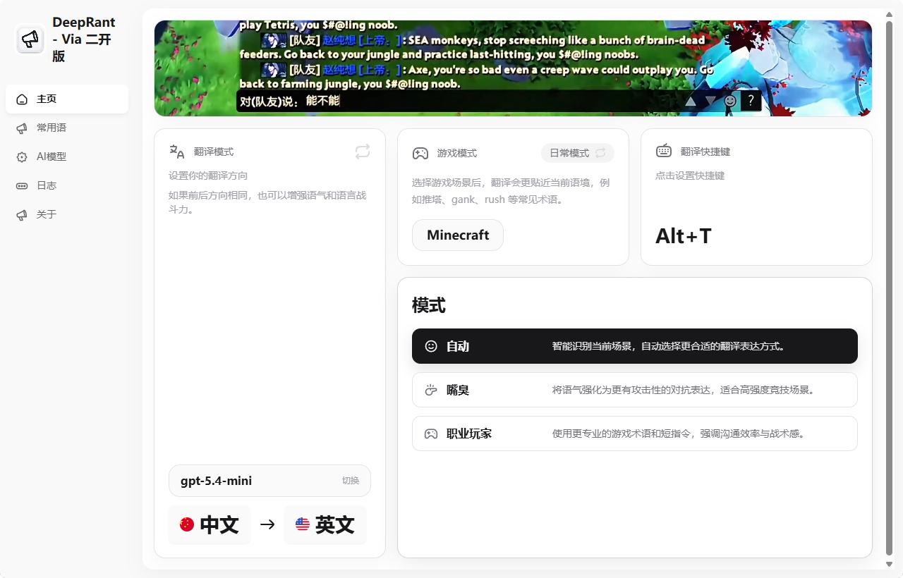

# DeepRant 游戏快捷翻译工具 🎮

  

  

## 🖼️ 功能预览

  

## 📝 项目简介

DeepRant 是一款专为游戏玩家设计的多语言快捷翻译工具。它能够帮助玩家在国际服务器中快速进行文字交流，让语言不再成为跨服竞技和日常沟通的障碍。

本版本为 **ViaVxxx 维护的二开版本**，在保留原版游戏翻译定位的基础上，补充了更适合持续使用与维护的能力。

## ✨ 主要功能

- 🚀 **快捷键翻译**：支持全局快捷键快速触发翻译
- 🌍 **多语言支持**：支持常见语言之间的双向翻译
- 🎭 **多种翻译模式**：自动、嘴臭、职业玩家三种模式
- 🎮 **游戏场景优化**：针对 MOBA、FPS 等场景保留专门优化
- 📚 **常用语管理**：支持增删改、排序和自定义快捷键
- 🪵 **日志功能**：支持日志查看、目录设置与日志级别切换

## 🧩 二开版增强内容

相较原版，当前二开版本主要增加了以下能力：

- 支持 **多个自定义服务商** 配置
- 支持通过 **`/v1/models`** 拉取服务商模型列表
- 支持 **Responses / Chat Completions** 两种请求方式切换
- 常用语界面支持 **新增、删除、编辑、排序**
- 增加独立的 **日志页面**，方便排查问题
- 优化主页布局与窗口交互体验

> 注意：当前版本**不内置免费模型**，也不会预置任何用户私有模型配置。用户需在 **AI模型** 页面中自行添加服务商、API Key 和模型。

## 🎯 使用场景

- 跨服竞技对战
- 国际服务器社交
- 多人在线游戏交流
- 电竞比赛实时沟通

## 🚀 快速开始

1. 从 Releases 下载最新版本
2. 安装并启动 DeepRant
3. 在 **AI模型** 页面中自行配置服务商与模型
4. 设置翻译快捷键
5. 开始游戏并使用快捷翻译

## ⌨️ 默认快捷键

- `Alt + T`：快速翻译

## 🛠️ 技术栈

- **前端**：React 18、Vite、TailwindCSS、Framer Motion
- **桌面框架**：Tauri 2
- **后端**：Rust

## 📜 开源协议

本项目采用 MIT 协议开源。

---

  Made with ❤️ for Gamers

